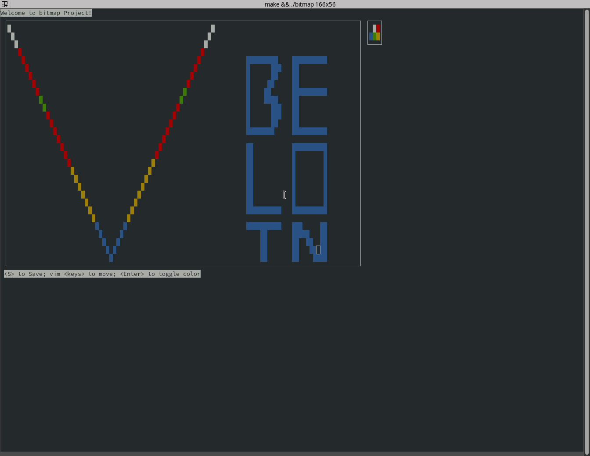

# Bitmap drawer

A simple app using NCurses to draw and save a bitmap file using colors.

Uses the `#pack push(...)` and `#pack pop` to save a struct into a
file using direct cast to `*char`.

Example:

